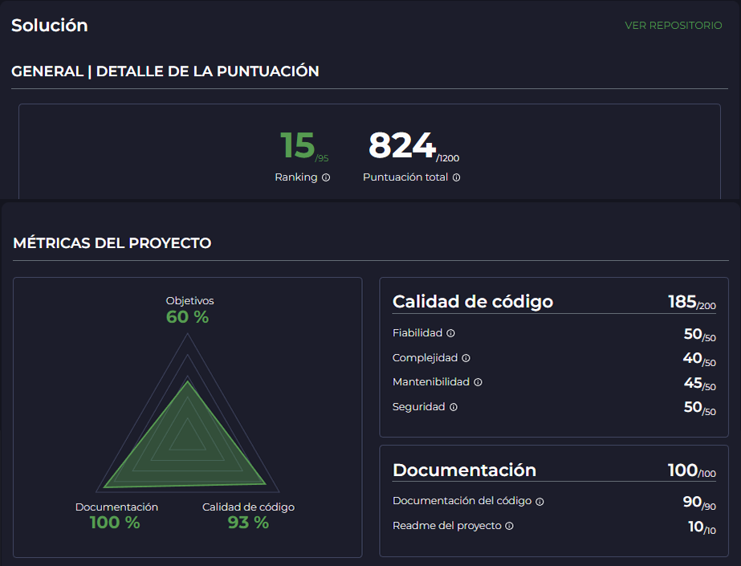



> Individual project about Random forest classifier
---
## Resultado:
#### [https://nuwe.io/dev/report/628948ef6321db001c3c49e6](https://nuwe.io/dev/report/628948ef6321db001c3c49e6)

---

## Dataset:
* `countryName`: Country in which the facility is located
* `EPRETRSectorCode`: Code of the sector in which the company specialises
* `eptrSectorName`: Name of the sector in which it specialises
* `EPRTRAnnexIMainActivityCode`: Code of the specialisation within the sector in which they operate
* `EPRTRAnnexIMainActivityLabel`: Specialisation within the sector in which they operate
* `FacilityInspireID`: Building identifier
* `facilityName`: Name of the building in which the activity takes place
* `City`: City in which the facility is located
* `CITY ID`: ID to confirm location
* `targetRelease`: Type of polluter to study
* `pollutant`: Type of pollutant emitted (Target variable). In order to follow the same standard, you must encode this variables as follows:
    * `Nitrogen oxides (NOX)`: 0
    * `Carbon dioxide (CO2)`: 1
    * `Methane (CH4)`: 2
* `DAY`: Day on which the report is made
* `MONTH`: Reporting month
* `reportingYear`: Reporting year
* `CONTINENT`: Continent on which the company is located
* `max_wind_speed`: Maximum wind speed
* `avg_wind_speed`: Average wind speed
* `min_wind_speed`: Minimum wind speed
* `max_temp`: Maximum temperature
* `avg_temp`: Average temperature
* `min_temp`: Minimum temperature
* `DAYS WITH FOG`: Total days of the month recorded in the area
* `REPORTER NAME`: Reporter's name

## Task
1. Create a model to predict the pollutant variable in the test_x dataset.
2. Create a presentation (MAX 4 slides) explaining what you have done and why you have done it

---
Created by Cesar Supo
